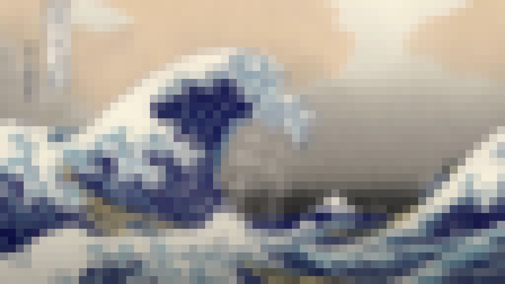

_Note: This repository has been moved to [Codeberg](https://codeberg.org/frica/pixelize)_.

# Pixelize

A Python tool that applies a stylish pixelation effect to your images. It downsizes images to specific dimensions and then scales them back up using nearest-neighbor interpolation to create a retro, blocky look.

## Features

- **Pixelation**: Automatically pixelates images to multiple sizes (default: 16, 32, 64 pixels on the longest side), preserving aspect ratio.
- **Batch Processing**: Processes all images in a specified directory.
- **GUI & CLI**: Choose between a user-friendly graphical interface or command-line interface.
- **Live Preview**: See pixelation effects in real-time before processing (GUI mode).
- **Customizable**: Configure input/output directories and pixelation sizes.
- **Cross-Platform**: Works seamlessly on Windows, macOS, and Linux.

## Example

| Original | Pixelated (64px) |
| :---: | :---: |
|  |  |

## Prerequisites

- [uv](https://github.com/astral-sh/uv) (Fast Python package installer and resolver)

## Dependencies

- Pillow (installed via `uv sync`)
- GTK 3 bindings for the GUI (system packages):
  - Ubuntu/Debian: `sudo apt install python3-gi gir1.2-gtk-3.0`

## Installation

1.  Clone this repository:
    ```bash
    git clone <repository-url>
    cd pixelize
    ```

2.  Install dependencies using `uv`:
    ```bash
    uv sync
    ```

## Usage

Pixelize offers a graphical user interface (GUI) and a command-line interface (CLI).

### GUI Mode (Recommended for beginners)

Launch the native GTK graphical interface:

```bash
python3 gui_gtk.py
```

**Note:** The GTK version (`gui_gtk.py`) provides native Ubuntu/GNOME integration with proper system fonts and styling. It must be run with system Python (`/usr/bin/python3`) because `uv` cannot access system GTK bindings.

The GUI provides:
- Native Ubuntu/GNOME appearance with system fonts
- Easy directory selection with Browse buttons
- Live preview of pixelation effects
- Side-by-side comparison of original and pixelated images
- Real-time progress tracking
- Status updates during processing

### CLI Mode

The CLI works with `uv` and does not require system Python.

You can also run the script directly using the command line.

### Basic Usage
Process images from the default `images/` directory and save them to `output/` with default sizes (16, 32, 64):

```bash
uv run main.py
```

### Custom Usage
Specify custom input/output directories and pixel sizes:

```bash
uv run main.py --input ./my_photos --output ./pixel_art --sizes 128 256
```

### CLI Options

| Option | Default | Description |
| :--- | :--- | :--- |
| `--input` | `images` | Directory containing input images. |
| `--output` | `output` | Directory where processed images will be saved. |
| `--sizes` | `16 32 64` | List of target pixel sizes for the maximum dimension (integers). |

## Example

To pixelate all images in `photos/` to 10x10 and 20x20 blocks and save them to `results/`:

```bash
uv run main.py --input photos --output results --sizes 10 20
```
